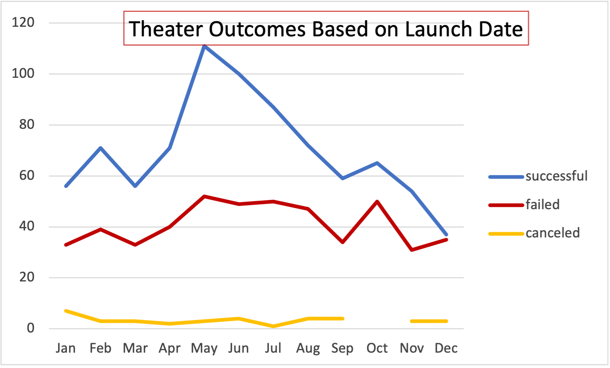

# Kickstarter-Analysis

# Kickstarting with Excel

## Overview of Project

### Purpose
 
 The purpose of this analysis was to determine how different fundraising campaigns fared in relation to their launch dates and their funding goals.

## Analysis and Challenges

### Analysis of Outcomes Based on Launch Date

  shows the status of the campaigns within the parent category of "theater," organized by month.

### Analysis of Outcomes Based on Goals

  shows fundraising outcomes of "play" campaigns, separating successful and failed ones based on their goals in increments of around $5000

## Challenges and Difficulties Encountered

### Results

- What are two conclusions you can draw about the Outcomes based on Launch Date?

    Based on the "Theater Outcomes by Launch Date" data, we can conclude that May and June are successful launch months with a 66% success rate. On the other hand, December is not an optimal launch month with a 50% success rate.

- What can you conclude about the Outcomes based on Goals?

    The data shows that campaigns with lower fundraising goals have higher success rates, while higher goal campaigns tend to have lower success rates. For campaigns with goals below $1000, the success rate is 76%, whereas those with goals above $50,000 have a success rate of only 13%. Furthermore, campaigns with goals between $15,000 to $19,999 have an equal chance of success or failure, at approximately 50%.  

